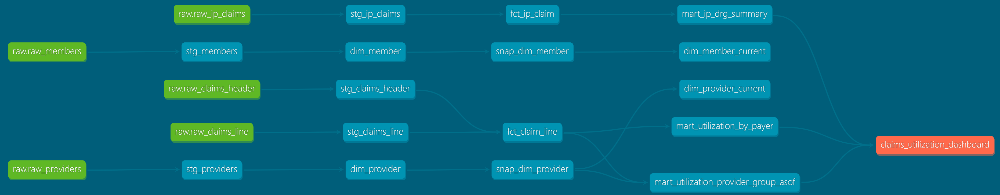
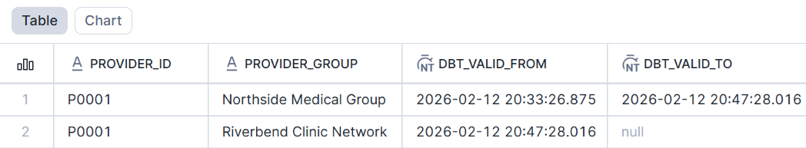
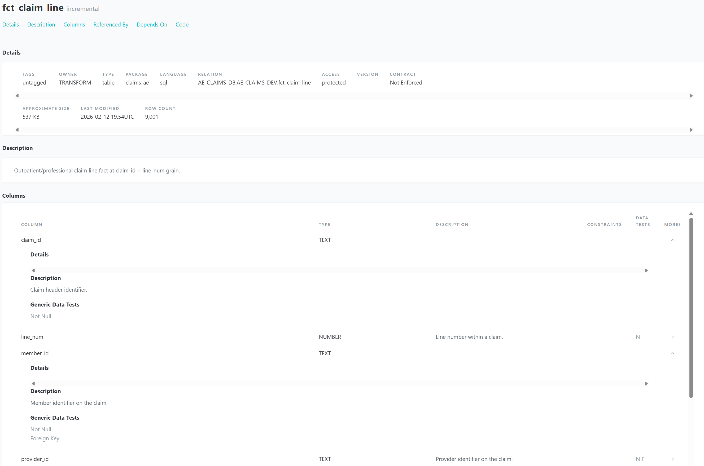
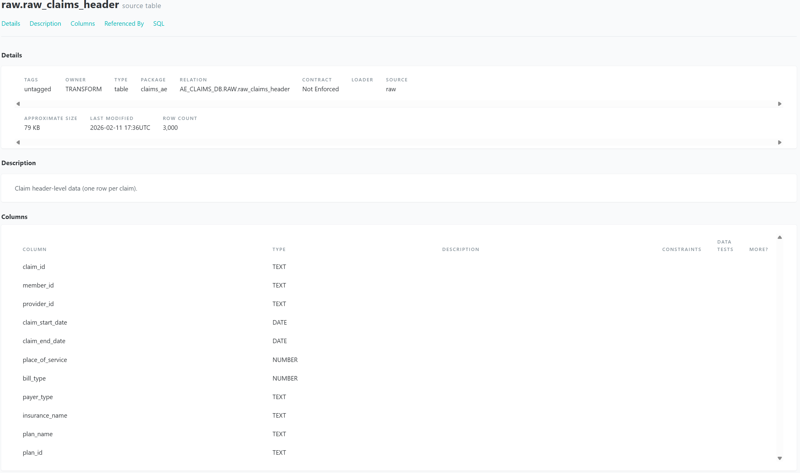

# Healthcare Claims Analytics Engineering (dbt + Snowflake)

## Overview
This project simulates a healthcare claims warehouse and analytics layer using **dbt Core** and **Snowflake**.
It demonstrates a modern AE workflow: **sources → staging → dimensional marts → incremental facts → analytics marts → SCD Type 2 snapshots**.

## Tech Stack
- dbt Core
- Snowflake
- GitHub

## Architecture / Lineage


## Data Model
**Sources (RAW)**
- raw_claims_header, raw_claims_line, raw_ip_claims, raw_members, raw_providers

**Staging (views)**
- stg_claims_header, stg_claims_line, stg_ip_claims, stg_members, stg_providers

**Dimensions (tables)**
- dim_member, dim_provider
- dim_member_current, dim_provider_current (current records from snapshots)

**Facts**
- fct_claim_line (incremental; grain = claim_id + line_num)
- fct_ip_claim (inpatient stay grain)

**Analytics marts**
- mart_utilization_by_payer
- mart_ip_drg_summary
- mart_utilization_provider_group_asof (SCD2 as-of join)

## Data Quality
- not_null + unique tests on dimension keys
- relationship tests (foreign key integrity)
- accepted_values test on payer_type

## Incremental Strategy
`fct_claim_line` is incremental to simulate late-arriving claims. Recent data is reprocessed using a lookback window and merged using a unique key.

## SCD Type 2 Snapshots
Provider and member attributes are tracked over time using dbt snapshots:
- `snap_dim_provider` tracks provider group/specialty changes
- `snap_dim_member` tracks member plan changes

Snapshot proof:


## Documentation
dbt docs examples:
- Fact tests + metadata:  
  
- Source definitions:  
  

## How to Run
```bash
dbt run
dbt test
dbt snapshot
dbt docs generate
dbt docs serve --port 8081
